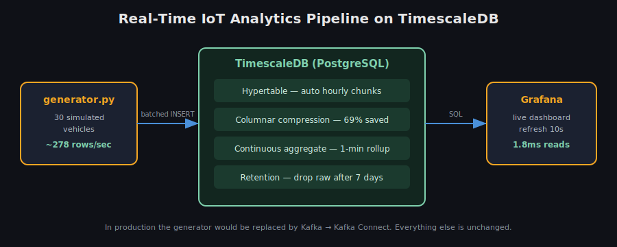
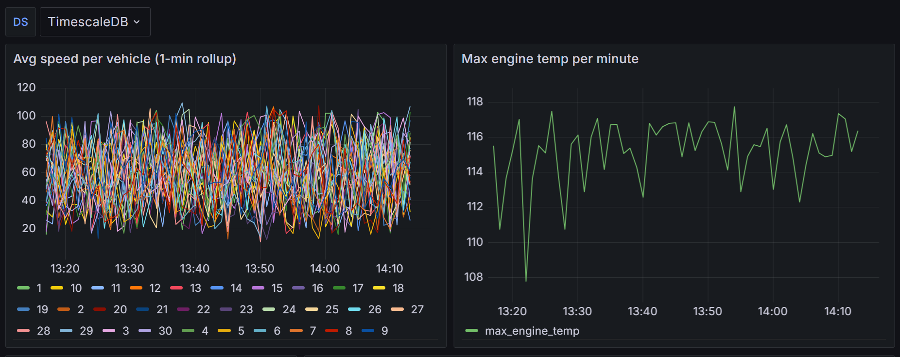

# Real-Time IoT Analytics Pipeline on TimescaleDB

A self-contained, reproducible demonstration of a **real-time vehicle-telemetry
analytics pipeline** built on **TimescaleDB** (PostgreSQL) with a live **Grafana**
dashboard. A Python generator simulates a fleet of vehicles streaming sensor
readings; TimescaleDB ingests, compresses, pre-aggregates and ages the data;
Grafana visualizes it in real time.

The entire stack runs with **one command** (`docker compose up -d`) and every
design decision, tuning choice and measured result is documented below.

> Inspired by Timescale's own write-up,
> [*Building a Real-Time IoT Analytics Pipeline*](https://medium.com/timescale/building-a-real-time-iot-analytics-pipeline-key-concepts-and-tools-3756cd093724),
> deliberately scoped to make the **database layer** the focus.



---

## Table of contents
1. [What this is](#what-this-is)
2. [Tech stack](#tech-stack)
3. [Architecture & data flow](#architecture--data-flow)
4. [TimescaleDB concepts explained](#timescaledb-concepts-explained)
5. [Quick start](#quick-start)
6. [Measured results (with calculations)](#measured-results-with-calculations)
7. [How scaling works (trillions of rows)](#how-scaling-works-trillions-of-rows)
8. [Troubleshooting log](#troubleshooting-log-real-issues-hit-and-fixed)
9. [Repository layout](#repository-layout)
10. [Dashboard](#dashboard)

---

## What this is

Imagine a fleet of 30 vehicles, each continuously reporting **speed, fuel level,
engine temperature and GPS position**. That is thousands of readings per minute.
This project handles that full flow end to end:

```
Simulated vehicles  →  TimescaleDB  →  Grafana dashboard
   (generator.py)       (store + shrink       (live charts,
                         + pre-summarize)       alerts)
```

It demonstrates the exact capabilities a production time-series platform relies
on: **hypertables, columnar compression, continuous aggregates, and retention
policies** — and it *measures* their impact rather than just describing them.

---

## Tech stack

| Layer | Technology | Role |
|---|---|---|
| **Database** | **TimescaleDB** (`timescaledb-ha:pg16`) | Time-series storage on PostgreSQL 16 |
| **Data generator** | **Python 3.12** + `psycopg2` | Simulates a live fleet, batched inserts |
| **Visualization** | **Grafana 11** | Live dashboard, auto-provisioned |
| **Orchestration** | **Docker Compose** | One-command, reproducible stack |
| **Query interface** | **SQL / PL-pgSQL**, `psql` | Schema, policies, EXPLAIN analysis |

**Production equivalents (not required to run this):** the direct Python writer
stands in for **Apache Kafka + Kafka Connect**, which is how high-volume ingestion
(100k+ rows/sec) is done in production. The database design is identical either way.

---

## Architecture & data flow

1. **`generator.py`** creates 30 `Vehicle` objects, each holding realistic state
   (speed, fuel, temperature, position).
2. Every tick, each vehicle's values **drift** within believable bounds (a car
   doesn't jump 60→5 kph instantly), and all 30 readings are inserted as a single
   **batch** — the same pattern a Kafka Connect sink uses.
3. **TimescaleDB** files each reading into the correct **hourly chunk**, compresses
   chunks older than 1 hour, keeps a **1-minute rollup** continuously refreshed,
   and drops raw chunks older than 7 days — all automatically via background jobs.
4. **Grafana** reads the pre-aggregated rollup and renders live charts every 10s.

---

## TimescaleDB concepts explained

### Hypertable (automatic time-partitioning)
A hypertable looks like one ordinary table but TimescaleDB transparently splits it
into **chunks**, one per time interval (here: **1 hour**).

```sql
SELECT create_hypertable('vehicle_telemetry', by_range('time', INTERVAL '1 hour'));
```

Why it matters: a query for "the last hour" reads **one small chunk** instead of
scanning the whole table, and each chunk can be compressed or dropped independently.

### Columnar compression
Old chunks are converted from row storage to **columnar** storage, grouping like
values together so they compress extremely well.

```sql
ALTER TABLE vehicle_telemetry SET (
    timescaledb.compress,
    timescaledb.compress_segmentby = 'vehicle_id',   -- keep per-vehicle data together
    timescaledb.compress_orderby   = 'time DESC'
);
SELECT add_compression_policy('vehicle_telemetry', compress_after => INTERVAL '1 hour');
```

`segmentby = vehicle_id` means a query for one vehicle only decompresses that
vehicle's data, not the entire chunk.

### Continuous aggregate (pre-computed, auto-refreshing summary)
A materialized rollup that refreshes **only new time buckets** on a schedule.

```sql
CREATE MATERIALIZED VIEW telemetry_1min
WITH (timescaledb.continuous) AS
SELECT time_bucket('1 minute', time) AS bucket, vehicle_id,
       avg(speed_kph) AS avg_speed, max(speed_kph) AS max_speed, ...
FROM vehicle_telemetry
GROUP BY bucket, vehicle_id;
```

The dashboard reads these ready-made summaries instead of recomputing from raw
rows — the single biggest query-speed win (see results below). Unlike a plain
Postgres materialized view, it refreshes incrementally and automatically.

### Retention policy
```sql
SELECT add_retention_policy('vehicle_telemetry', drop_after => INTERVAL '7 days');
```
Raw data older than 7 days is dropped a **whole chunk at a time** (near-instant),
while the continuous aggregate preserves the historical summary.

---

## Quick start

Requires **Docker** and **Python 3.9+**.

```bash
# 1. Start TimescaleDB + Grafana (schema builds automatically on first boot)
docker compose up -d

# 2. Install the generator's one dependency
pip install -r requirements.txt

# 3. Seed 4h of history, then stream live data (~278 rows/sec)
python generator.py --vehicles 30 --rate 300 --backfill-hours 4
```

- **Grafana:** http://localhost:3000  (admin / admin) → *Fleet Overview* (pre-provisioned)
- **Database shell:** `docker exec -it iot_timescaledb psql -U iot -d iot`
- **Stop everything:** `docker compose down`  (add `-v` to also wipe data)

---

## Measured results (with calculations)

All figures below were measured on this stack. Reproduce them with the scripts in
[`queries/`](queries/). Sample run: **797,880 rows**, 30 vehicles, ~4h45m span,
**114 MB** raw, live ingest **~278 rows/sec**.

### 1. Columnar compression — 69% storage saved

```
before compression : 5544 kB
after  compression : 1696 kB
saved = (5544 - 1696) / 5544 = 3848 / 5544 = 0.694  →  69.4%
```

4 of 6 chunks were compressed (the 2 newest stay raw because data is still
arriving). Query: [`queries/03_compression_ratio.sql`](queries/03_compression_ratio.sql).

### 2. Query speedup — continuous aggregate vs. raw scan

Same question ("average speed per minute for the last hour"), two ways
([`queries/02_explain_plans.sql`](queries/02_explain_plans.sql)), warm cache:

| Source | Execution time | Rows processed |
|---|---|---|
| Raw hypertable (`ChunkAppend` + `VectorAgg` + `HashAggregate`) | ~230 ms | ~40,000 raw rows aggregated live |
| Continuous aggregate (`telemetry_1min`) | **~0.76 ms** | pre-materialized buckets read directly |

```
speedup = 230 ms / 0.76 ms  ≈  300× faster (warm cache)
```

The raw query must scan and aggregate tens of thousands of rows on every request;
the continuous aggregate did that work ahead of time, so it simply reads the answer.

### 3. Chunk exclusion — why it scales

`EXPLAIN` of a 30-minute query shows the planner touches **only the 2 relevant
chunks** and excludes the older 4 entirely:

```
Custom Scan (ChunkAppend) on vehicle_telemetry
   -> Index Scan on _hyper_1_5_chunk    (7:00–8:00)
   -> Seq Scan   on _hyper_1_10_chunk   (8:00–9:00)
   (chunks 1–4 for 3:00–7:00 are never read)
```

This is the core reason a hypertable stays fast even as the table grows to
billions of rows: queries are bounded by their **time range**, not table size.

---

## How scaling works (trillions of rows)

The design here is the *same* one used in production at massive scale — only the
surrounding infrastructure grows:

| Challenge at scale | Mechanism |
|---|---|
| Query stays fast on huge tables | **Chunk exclusion** — only time-relevant chunks are read |
| Storage cost of trillions of rows | **Compression** (90%+ at scale) |
| Data outgrows local disk | **Tiered storage** — cold chunks move to object storage (S3), still queryable |
| Old raw data rarely needed | **Retention + continuous aggregates** — drop raw, keep summaries forever |

TimescaleDB scales primarily **vertically** (one powerful node + tiering) rather
than by sharding across many nodes, betting that smart chunking + compression +
tiering beats brute-force sharding for time-series workloads.

---

## Troubleshooting log (real issues hit and fixed)

The same diagnose-and-fix loop a support engineer runs on customer databases.

**1. `ERROR: policy refresh window too small`**
The continuous-aggregate policy failed on startup: *"start and end offsets must
cover at least two buckets."*
- **Cause:** with a 1-minute bucket, the refresh window (`start_offset => 2 min`,
  `end_offset => 10 s`) spanned less than two full buckets.
- **Fix:** widened to `start_offset => 10 min`, `end_offset => 1 min`. TimescaleDB
  refuses windows that can't materialize a complete bucket, to avoid partial rollups.

**2. Compression reported 0 chunks / no savings**
`compress_chunk(... older_than => 1 hour)` compressed nothing and stats were empty.
- **Cause:** the hypertable used a **1-day chunk interval**, so several hours of
  backfilled data all landed in a single "current" chunk not yet older than 1 hour.
- **Diagnosis:** `timescaledb_information.chunks` showed only one chunk.
- **Fix:** switched to a **1-hour chunk interval** so older, closed chunks exist to
  compress → 4 of 6 chunks compressed, 69% saved. Takeaway: chunk interval must be
  sized against data rate *and* compression policy.

**3. Rollup panel lags ~1–2 min behind live**
The dashboard's rollup lines stop just short of "now".
- **Cause:** the continuous aggregate refreshes only up to `end_offset => 1 min`
  ago, on a 1-minute schedule — by design.
- **Resolution:** intended freshness-vs-speed trade-off. For truly live values query
  the raw hypertable; for fast historical rollups query the aggregate.

---

## Repository layout

```
docker-compose.yml      TimescaleDB + Grafana services
schema.sql              hypertable, compression, continuous aggregate, retention
generator.py            simulated fleet telemetry stream (backfill + live)
requirements.txt        psycopg2
queries/
  01_hypertable_health.sql    chunks, sizes, compression status
  02_explain_plans.sql        raw vs. continuous-aggregate EXPLAIN ANALYZE
  03_compression_ratio.sql    measured compression savings
dashboards/
  fleet_overview.json         Grafana dashboard
  provisioning/               auto-load datasource + dashboard
docs/
  architecture.svg            architecture diagram
  dashboard.png               dashboard screenshot
```

---

## Dashboard

Open http://localhost:3000 → **Fleet Overview**. Panels:

- **Avg speed per vehicle (1-min rollup)** — one line per vehicle, from the
  continuous aggregate.
- **Max engine temp per minute** — fleet-wide temperature trend.
- **Readings ingested (last 5m)** — live ingest counter.
- **Low fuel alert (< 15%)** — vehicles needing refueling.


